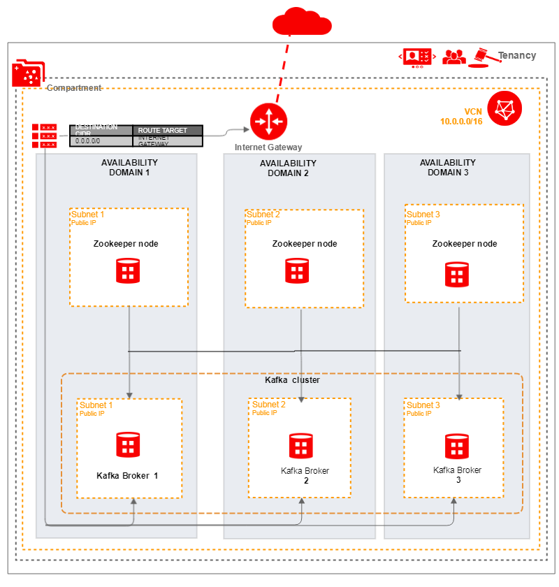

# oci-quickstart-kafka
These are Terraform modules that deploy [Kafka](https://kafka.apache.org/) on [Oracle Cloud Infrastructure (OCI)](https://cloud.oracle.com/en_US/cloud-infrastructure).

## About
The Kafka Oracle Cloud Infrastructure Module provides a Terraform-based Kafka Cluster installation for Oracle Cloud Infrastructure (OCI). This will provide user one Kafka cluster which is used for building real-time data pipelines and streaming apps. It is horizontally scalable, fault-tolerant, wicked fast, and runs in production in thousands of companies.



## Prerequisites
1. Download and install Terraform (v0.10.3 or later)
2. Download and install the OCI Terraform Provider (v2.0.0 or later)
3. Export OCI credentials. (this refer to the https://github.com/oracle/terraform-provider-oci )

## What's a Module?
A Module is a canonical, reusable, best-practices definition for how to run a single piece of infrastructure, such as a database or server cluster. Each Module is created using Terraform, and includes automated tests, examples, and documentation. It is maintained both by the open source community and companies that provide commercial support.
Instead of figuring out the details of how to run a piece of infrastructure from scratch, you can reuse existing code that has been proven in production. And instead of maintaining all that infrastructure code yourself, you can leverage the work of the Module community to pick up infrastructure improvements through a version number bump.

## How to use this Module
Each Module has the following folder structure:
* [root](): This folder contains a root module calls Kafka sub-modules to create a Kafka cluster in OCI.
* [modules](): This folder contains the reusable code for this Module, broken down into one or more modules.
* [examples](): This folder contains examples of how to use the modules.
  - [example-1](examples/example-1): This is an example of how to use the terraform_oci_kafka module to deploy a Kafka cluster in OCI by using an existing VCN, Security list and Subnets.
  - [example-2](examples/example-2): This example creates a VCN in Oracle Cloud Infrastructure including default route table, DHCP options, security list and subnets from scratch, then use terraform_oci_kafka module to deploy a Kafka cluster.

To deploy Kafka Cluster using this Module:

```hcl
module "kafkas" {
  source                           = "git::ssh://git@bitbucket.oci.oraclecorp.com:7999/tfs/terraform-oci-kafkas.git?ref=dev"
  compartment_ocid                 = "${var.compartment_ocid}"
  dns_label                        = "${var.dns_label}"
  label_prefix                     = "${var.label_prefix}"
  ads                              = "${var.ads}"
  subnet_ids                       = "${var.subnet_ids}"
  image_id                         = "${var.image_id}"
  zookeeper_client_port            = "${var.zookeeper_client_port}"
  zookeeper_internal_port          = "${var.zookeeper_internal_port}"
  zookeeper_poll_port              = "${var.zookeeper_poll_port}"
  kafka_client_port                = "${var.kafka_client_port}"
  number_of_instance               = "${var.number_of_instance}"
  ssh_authorized_keys              = "${var.ssh_authorized_keys}"
  ssh_private_key                  = "${var.ssh_private_key}"
}
```

Argument | Description
--- | ---
compartment_ocid | Compartment's OCID where VCN will be created.
dns_label | Allows assignment of DNS hostname when launching an Instance.
label_prefix | To create unique identifier for multiple clusters in a compartment.
ads | The Availability Domain for instances.
subnet_ids  | The OCID of the subnet to create the VNIC in.
image_id | The OCID of an image for a instance to use.
zookeeper_client_port | The port for Zookeeper client.
zookeeper_internal_port | The internal port for Zookeeper.
zookeeper_poll_port | The poll port for Zookeeper.
kafka_client_port | The client port for Kafka.
number_of_instance | The number of instance(s) to create.
ssh_authorized_keys | Public SSH keys path to be included in the ~/.ssh/authorized_keys file for the default user on the instance.
ssh_private_key | The private key path to access instance.
